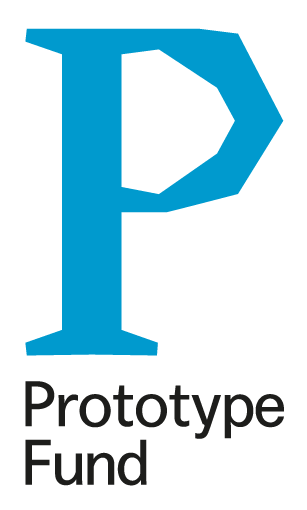

## Quellenreiter:in | Fake News Quiz App
A mobile quiz app for android and ios build using flutter and Back4App.
## Contents
- [Quellenreiter:in | Fake News Quiz App](#quellenreiterin--fake-news-quiz-app)
- [Contents](#contents)
- [Base Project](#base-project)
  - [Aim 🏹](#aim-)
- [Functionality 🦾](#functionality-)
- [Implementation 🖥️](#implementation-️)
- [Installation](#installation)
- [Acknowledgements](#acknowledgements)
- [Funding](#funding)
## Base Project
This application belongs to the [QuellenReiter:in project](quellenreiter.app) created and implemented by Simon Sasse and Jannik Werner. The project consists of a "Fake News" database whcih is openly accesible through this frontend. In addition, a "Fake News" Quiz App derives its quests from the database.
### Aim 🏹
Our aim is to tackle the issue of misinformation (in germany) with a playful approach and open-data. 
## Functionality 🦾

## Implementation 🖥️
The application is implemented using [flutter](https://flutter.dev) and [dart](https://dart.dev). Flutter is an open-source and cross-plattform app framework created by google. Furthermore, [GraphQL](https://graphql.org) is used to query and mutate the database which is a [Parse Server](https://parseplatform.org) hosted on [Back4App](https://www.back4app.com). All these projects are open-source themselves.

## Installation 
**!! This code is only usable with a working flutter installation !!** 
Note: If you have never used flutter, consider its [documentation](https://docs.flutter.dev)
1. Follow install instructions for [flutter](https://docs.flutter.dev/get-started/install).
2. `git clone https://github.com/QuellenReiter/quellenreiter_app.git`
3. Open the project in your text editor or IDE and run `flutter doctor` to check if everything works fine.
4. To run the application use `flutter run -d [ios, android]`.

## Acknowledgements
Programming: Simon Sasse 
Concept: Jannik Werner & Simon Sasse 
## Funding
This project is funded by:

  
   
  

